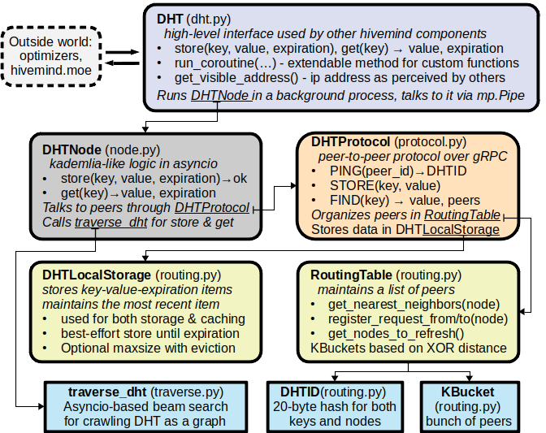

``hidemind.dht``
====================

.. automodule:: hivemind.dht

.. currentmodule:: hivemind.dht

.. autoclass:: HivemindDHT
   :members:
   :exclude-members: make_key
   :member-order: bysource

.. autoclass:: DHTNode
   :members:
   :member-order: bysource