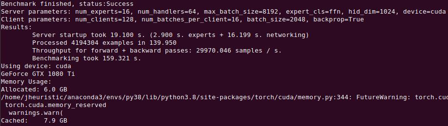
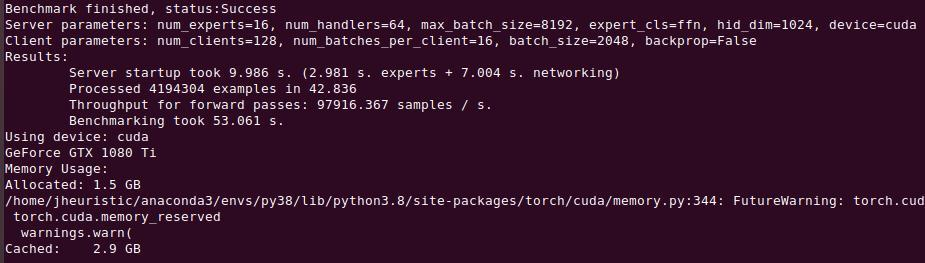
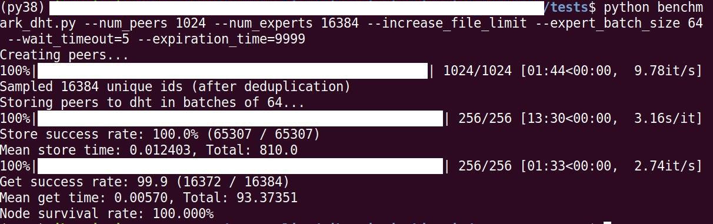

## Contributing

#### Collaborating best practices:
Hivemind is still in the early stage of development, we expect only a handful of collaborators with individual roles.

1. Before you write any code, please contact us to avoid duplicate work:
   * Report bugs and propose new features via issues. We don't have strict templates at this point;
   * If you decide to implement a feature or fix a bug, first leave a comment in the appropriate issue or create a
    new one;
   * Please follow [Contributor Convent v2.0](https://www.contributor-covenant.org/version/2/0/code_of_conduct/).
2. When you code, follow the best practices:
   * The code must follow [PEP8](https://www.python.org/dev/peps/pep-0008/) unless absolutely necessary.
     We recommend pycharm IDE;
   * All user-facing interfaces must be documented with docstrings and/or sphinx;
   * We highly encourage the use of [typing](https://docs.python.org/3/library/typing.html), where applicable;
3. After you write the code, make sure others can use it:
   * Any function exposed to a user must have a docstring compatible with [readthedocs](https://sphinx-rtd-tutorial.readthedocs.io/en/latest/docstrings.html);
   * For new features, please write test(s) to make sure your functionality won't be broken by subsequent changes;
   * If you face any challenges or want feedback, please submit a [draft](https://github.blog/2019-02-14-introducing-draft-pull-requests/) pull request.


#### Contributor's manual

First, install hivemind in the development mode, preferably with python 3.8 on linux/mac_OS.
```
git clone https://github.com/learning-at-home/hivemind
cd hivemind
python setup.py develop
``` 

To run tests, you will also need to `pip install pytest codecov tqdm scikit-learn`.
You can run all tests with `pytest ./tests` or choose a specific set, e.g. `pytest ./tests/test_dht.py`.

To build docs locally,
1. `pip install sphinx sphinx_rtd_theme recommonmark`
2. make sure you ran setup.py (see above)
3. `cd ./docs && make html`

The documentation root will be available in `./docs/_build/html/index.html`


#### Benchmark throughput
You can use [this benchmark](https://github.com/learning-at-home/hivemind/blob/master/tests/benchmark_throughput.py) to check the performance impact of your changes to hivemind.client and server.
The benchmark will start one server without dht with several experts, and then spawn trainer processes that bombard the server with requests.
The two main statistics in this benchmark samples/s and startup time. 

* `python benchmark_throughput.py --preset default` (aka `ffn_forward_backward`)

* `python benchmark_throughput.py --preset ffn_forward`



All tests were performed on a single machine with ubuntu server 18.04 x64, msi 1080ti turbo, xeon gold 6149, 
 384Gb LRDIMM (6x64G), python3.8, torch1.6.0 (pip-installed), grpcio 1.31.0 , 
 the results have around +-5% fluctuation between consecutive runs. 

#### Benchmark DHT
In turn, [this benchmark](https://github.com/learning-at-home/hivemind/blob/master/tests/benchmark_dht.py) can be used
to measure performance impact of changes to hivemind.dht. It spawns a DHT with `num_peers` participants, 
then chooses one peer that will declare `num_experts` total experts in batches of `expert_batch_size`.
Then, another peer will consecutively get all peers and check if they are there.

Here's a run with 1024 participants on the same machine that was used benchmark_throughput:



The three main statistics in this benchmark are total store time, total get time and get success rate.
Please also note that this benchmark does not emulate node failure, latency and does not benefit from caching.
If one wants to account for these factors, one must introduce them manually by changing the code.
  

#### Tips & tricks
* You can find a wealth of pytorch debugging tricks at [their contributing page](https://github.com/pytorch/pytorch/blob/master/CONTRIBUTING.md).
* Hivemind is optimized for development in pycharm CE 2019.3 or newer.
  * When working on tests, please mark "tests" as sources root.
